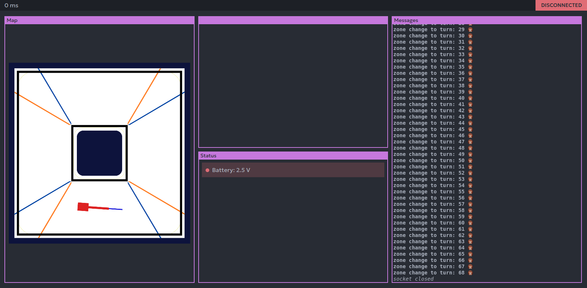

# Epopeya
## Hardware
We use a combination of 3 chips to divide the task evenly. The slave is tasked with controlling the motor and servo, while the master handles the navigation. One additional micorcontorller is used as a web server
## Software
The robot uses an axis following system to navigate the map. When a block is detected, it offsets the axis to avoid the block.
### Debugging
The debugging controler exposes a web server that includes a client that comunicates with weebsockets to display relevante information.

