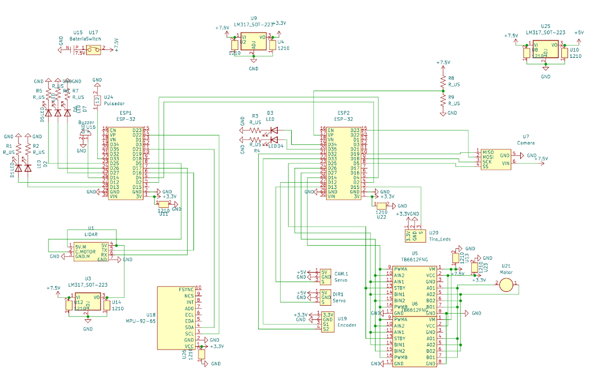
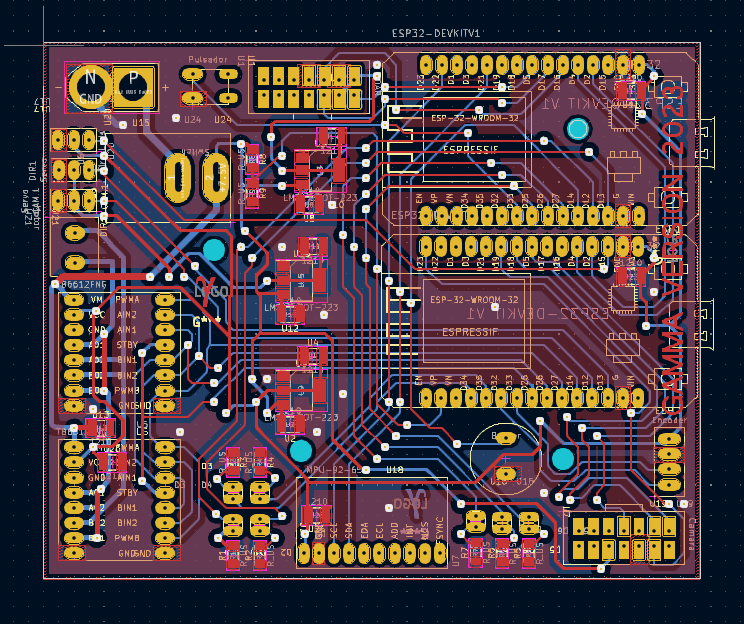

# Epopeya
We are a team participating on the *WRO* competition. All our code is on this same github organization, named `Epopeya`.

The goal is to create a self-driving vehicle that is capable of doing 3 laps around a square.

## Hardware
We use a combination of 3 chips to divide the task evenly.
- **The slave** is tasked with controlling the motor and servo.
- **The master** handles the navigation.
- **The debugger** is one additional (and removable) micorcontorller used as a web server.

Each chip has the codebase in a different repo, to favor readability and code organization:
- [Slave](https://github.com/Epopeya/Slave)
- [Master](https://github.com/Epopeya/Master)
- [Debugger](https://github.com/Epopeya/Web-Debug)

### Components
The main components on the robot are:
- Imu
- Lidar
- Servo
- Differential motor
- HuskyLens Camera

### PCB
We use a single PCB to connect all these Components.

## Software
The robot uses an axis following system to navigate the map. When a block is detected, it offsets the axis to avoid the block.
### Debugging
The debugging controler exposes a web server that includes a client that comunicates with weebsockets to display relevante information.

